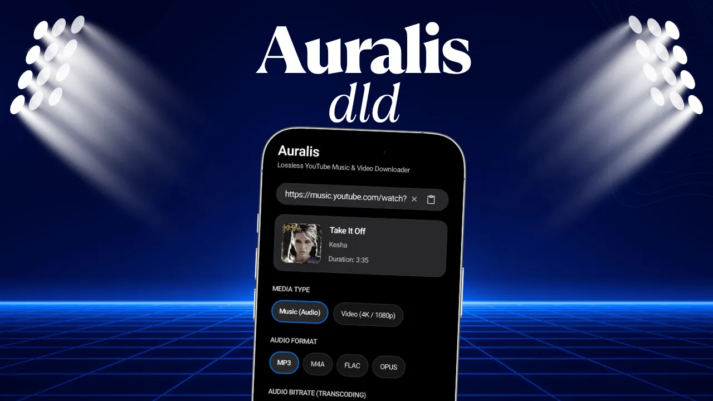
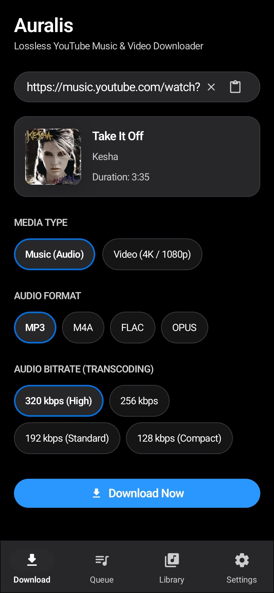
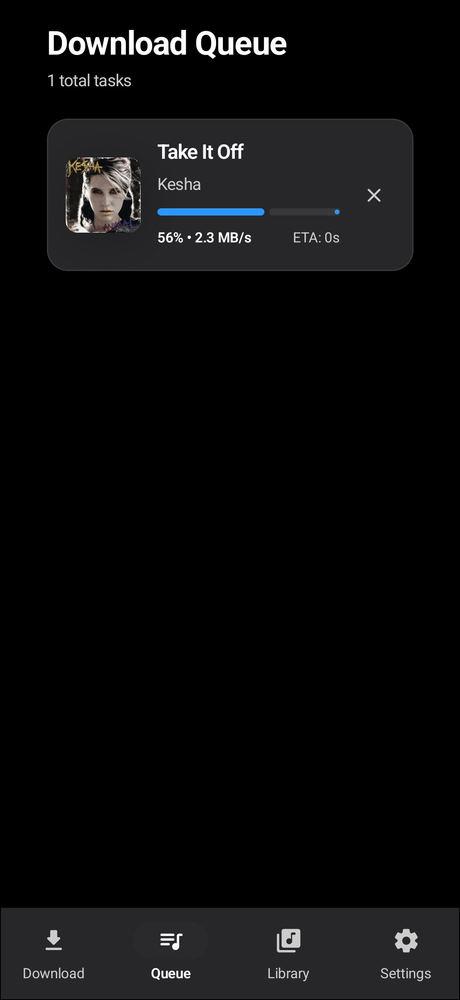
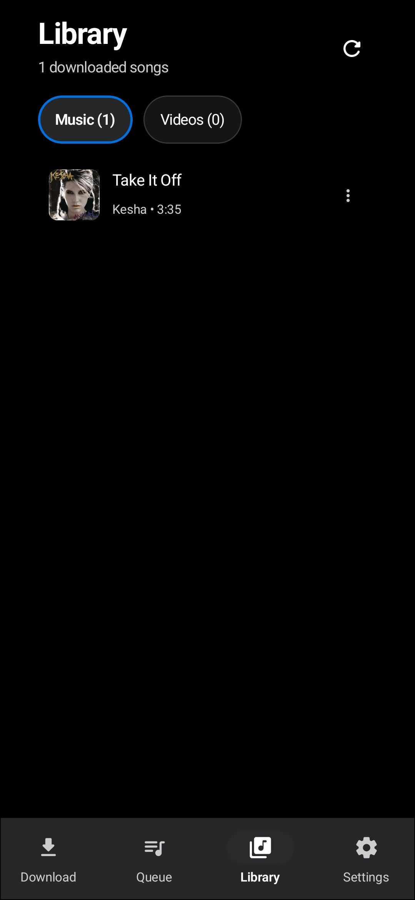
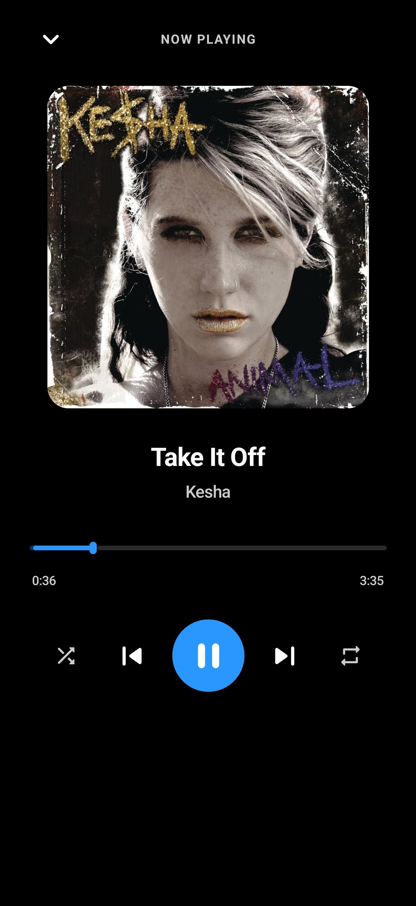

<p align="center">
  
</p>

<h1 align="center">Auralis</h1>

<p align="center">
  <strong>Lossless YouTube Music & Video Downloader for Android</strong><br>
  <em>High-performance client-side extractor, embedded Media3 offline player, and lossless media manager.</em>
</p>

<p align="center">
  <a href="https://android.com"></a>
  <a href="https://kotlinlang.org"></a>
  <a href="https://developer.android.com/jetpack/compose"></a>
  <a href="https://chaquo.com/chaquopy/"></a>
  <a href="LICENSE"></a>
  <a href="CONTRIBUTING.md"></a>
</p>

<p align="center">
  
</p>

---

## 📑 Table of Contents

- [Overview](#-overview)
- [Key Features](#-key-features)
- [App Showcase](#-app-showcase)
- [Architecture & Tech Stack](#-architecture--tech-stack)
- [Getting Started](#-getting-started)
  - [Prerequisites](#prerequisites)
  - [Build Instructions](#build-instructions)
  - [Installing via ADB](#installing-via-adb)
- [Permissions](#-permissions)
- [Security & Privacy](#-security--privacy)
- [Legal Disclaimer](#-legal-disclaimer)
- [Contributing](#-contributing)
- [License](#-license)

---

## 🌟 Overview

**Auralis** is a privacy-first, zero-telemetry Android application designed to extract, download, tag, and play YouTube music and high-definition video directly on your Android device.

Unlike traditional download tools that route your requests through private middleman backend servers (which introduce latency, rate limits, tracking, and downtime risk), **Auralis runs a 100% on-device extraction pipeline** powered by an embedded Python 3.10 engine via Chaquopy. Your device communicates directly with media CDNs, ensuring maximum transfer speeds, complete privacy, and zero server reliance.

---

## ✨ Key Features

### 🎧 Lossless Audio & Transcoding
- **Original Raw Stream Extraction**: Grab untouched Opus and AAC streams directly from YouTube for pure lossless preservation.
- **On-Device Audio Transcoding**: High-bitrate encoding to **MP3** (up to 320 kbps CBR/VBR), **M4A (AAC)**, **FLAC (24-bit lossless)**, and **Opus**.
- **Automated ID3 & Metadata Tagging**: Uses `mutagen` to embed high-resolution square album artwork, track title, artist, album name, and release year directly into output files.

### 🎬 High-Definition Video Downloader
- **Up to 4K UHD & 1080p 60FPS**: Stream demuxing and remuxing into industry-standard MP4 format with synchronized audio.
- **Android Scoped Storage**: Downloaded videos are indexed immediately in `Movies/Auralis` via Android's MediaStore API, accessible across your favorite gallery and video player apps.

### 📱 Built-in Offline Media Player
- **Background Audio Player**: Backed by **AndroidX Media3 `MediaSessionService`**. Features persistent foreground notifications, lockscreen media controls, seamless playlist queuing, and system volume ducking.
- **Offline Video Player**: Custom gestural video player supporting:
  - Vertical swipe gestures for **brightness** (left) and **volume** (right).
  - Double-tap seek (10s back / forward).
  - Aspect ratio toggle (**Fit**, **Zoom/Fill**, **Stretch**).
  - Variable playback speed (0.5x to 2.0x).

### ⚡ In-App Dynamic Engine Updater
- YouTube regularly alters its player cipher and signature decoding algorithms.
- Auralis includes an **in-app dynamic engine updater** in Settings. Fetch the latest `yt-dlp` updates on-the-fly without needing to wait for a new APK release.

### 🎨 Clean & Modern Design
- Built from the ground up with **Jetpack Compose**.
- Strict adherence to the `DESIGN.md` design system: rich dark theme, disciplined color accents, zero visual clutter, and responsive centering across phones, foldables, and tablets.

---

## 📸 App Showcase

<table align="center" style="margin: 0 auto; text-align: center;">
  <tr>
    <th width="50%" align="center"><b>Home & Metadata Extraction</b></th>
    <th width="50%" align="center"><b>Concurrent Download Queue</b></th>
  </tr>
  <tr>
    <td align="center">
      
      <br>
      <em>Instant link inspection, format chips (MP3, M4A, FLAC, MP4), and bitrate selection.</em>
    </td>
    <td align="center">
      
      <br>
      <em>Real-time progress bars, download speed (MB/s), ETA timer, and task cancellation.</em>
    </td>
  </tr>
  <tr>
    <th width="50%" align="center"><b>Offline MediaStore Library</b></th>
    <th width="50%" align="center"><b>Integrated Media Player</b></th>
  </tr>
  <tr>
    <td align="center">
      
      <br>
      <em>Dual-tab organization for Music and Videos with direct Scoped Storage integration.</em>
    </td>
    <td align="center">
      
      <br>
      <em>Rich full-screen audio player with album art, smooth seekbar, and repeat/shuffle modes.</em>
    </td>
  </tr>
</table>

---

## 🏗️ Architecture & Tech Stack

Auralis follows **Clean Architecture** and **MVI (Model-View-Intent)** principles with unidirectional data flow (UDF).

```
E:\Tools\auralis-dld/
├── app/src/main/
│   ├── java/com/auralis/dld/
│   │   ├── data/
│   │   │   ├── model/                  # Domain & DTO models (MediaItem, DownloadTask, StreamInfo)
│   │   │   └── repository/
│   │   │       ├── DownloadRepository.kt       # Download state & queue StateFlow manager
│   │   │       ├── MediaStoreRepository.kt     # Scoped Storage query/write for Audio & Video
│   │   │       └── PythonEngineRepository.kt   # Chaquopy JNI bridge (extraction & tagging)
│   │   ├── player/
│   │   │   ├── AuralisPlayerController.kt      # Singleton ExoPlayer session controller
│   │   │   └── PlayerState.kt                  # Immutable UI state for playback & progress
│   │   ├── service/
│   │   │   ├── DownloadService.kt              # Foreground download service with notification
│   │   │   └── PlaybackService.kt              # Media3 MediaSessionService for audio & video
│   │   ├── ui/
│   │   │   ├── components/                     # Atomic design system (Buttons, Chips, Sliders)
│   │   │   ├── home/                           # URL input, format selector & metadata preview
│   │   │   ├── queue/                          # Live download tasks, speed & ETA
│   │   │   ├── library/                        # Dual-tab MediaStore library (Songs & Videos)
│   │   │   ├── player/                         # Full audio player & gestural video player modals
│   │   │   ├── settings/                       # Theme mode & dynamic engine updater
│   │   │   └── theme/                          # Curated palette, typography, and shape system
│   │   └── AuralisApp.kt                       # Application lifecycle & Chaquopy initialization
│   └── python/
│       └── auralis/
│           ├── extractor.py                    # yt-dlp extraction wrapper & format sorting
│           ├── downloader.py                   # Chunked media downloader with progress callback
│           └── tagger.py                       # Mutagen ID3/MP4/FLAC metadata & artwork embedder
```

### Core Technologies
| Component | Technology | Version |
| :--- | :--- | :--- |
| **Language** | Kotlin | `2.0.21` |
| **Runtime Target** | Java / JVM | `Java 17` |
| **UI Framework** | Jetpack Compose (BOM) | `2024.10.01` |
| **Embedded Python** | Chaquopy | `15.0.1` (Python 3.10) |
| **Media Playback** | AndroidX Media3 (ExoPlayer + MediaSession) | `1.4.1` |
| **Async Image Loading** | Coil | `2.7.0` |
| **Concurrency** | Kotlin Coroutines & StateFlow | `1.8.1` |
| **Build System** | Gradle (Kotlin DSL) | `8.9` |

---

## 🚀 Getting Started

### Prerequisites
- **Android Studio**: Ladybug (2024.2.1+) or newer
- **JDK**: OpenJDK 17 or higher
- **Android SDK**: Compile SDK `35`, Min SDK `26` (Android 8.0 Oreo)
- **NDK**: Installed via Android Studio SDK Manager (required for Chaquopy ABI builds)
- **Target Device / Emulator**: Running Android 8.0+ (ARM64-v8a or x86_64)

### Build Instructions

1. **Clone the Repository**:
   ```bash
   git clone https://github.com/dusmamud/auralis.git
   cd auralis
   ```

2. **Verify Environment**:
   Ensure `JAVA_HOME` points to JDK 17+:
   ```bash
   java -version
   ```

3. **Compile Debug APK**:
   ```bash
   # On Windows PowerShell / Command Prompt
   .\gradlew assembleDebug

   # On macOS / Linux
   ./gradlew assembleDebug
   ```

4. **Run Unit Tests**:
   ```bash
   ./gradlew testDebugUnitTest
   ```

The compiled APK will be generated at:
```
app/build/outputs/apk/debug/app-debug.apk
```

### Installing via ADB

To install directly onto a connected USB or Wi-Fi debugging device:
```bash
adb install -r app/build/outputs/apk/debug/app-debug.apk
```

---

## 🛡️ Permissions

Auralis requires minimal permissions strictly necessary for its functionality:

| Permission | Purpose |
| :--- | :--- |
| `INTERNET` | Communicates directly with YouTube servers to fetch metadata and stream bytes. |
| `ACCESS_NETWORK_STATE` | Detects network availability before dispatching downloads. |
| `FOREGROUND_SERVICE` | Keeps download and media playback services active in the background. |
| `FOREGROUND_SERVICE_DATA_SYNC` | Ensures uninterrupted file downloading when the screen is turned off. |
| `FOREGROUND_SERVICE_MEDIA_PLAYBACK` | Handles persistent lockscreen audio playback via Media3. |
| `POST_NOTIFICATIONS` | Displays interactive download progress and playback notification controls (Android 13+). |
| `READ_MEDIA_AUDIO` / `READ_MEDIA_VIDEO` | Reads downloaded songs and videos in the Library tab (Android 13+). |
| `READ_EXTERNAL_STORAGE` | Backward-compatibility read access on Android 8.0 - 12. |

---

## 🔒 Security & Privacy

- **Zero Telemetry**: Auralis does not include analytics, telemetry, trackers, or crash-reporting SDKs.
- **Direct Connection**: No proxy or intermediary servers are involved. The requests travel directly between your phone and the media host.
- **Local Sandbox**: All audio transcoding, image processing, and ID3 tag writing occur completely on-device.
- For vulnerability reports and security best practices, please consult our [Security Policy](SECURITY.md).

---

## ⚖️ Legal Disclaimer

Auralis is developed solely for **educational, personal archival, and research purposes**. 

The application is not affiliated with, authorized, maintained, sponsored, or endorsed by YouTube, Google LLC, or Alphabet Inc. All product and company names are trademarks™ or registered® trademarks of their respective holders.

Please review our complete [Disclaimer & DMCA Policy](DISCLAIMER.md) before downloading or using this software.

---

## 🤝 Contributing

Contributions, bug reports, and feature proposals are welcome! 

1. Fork the Project.
2. Create your Feature Branch (`git checkout -b feature/AmazingFeature`).
3. Commit your Changes (`git commit -m 'feat: add some amazing feature'`).
4. Push to the Branch (`git push origin feature/AmazingFeature`).
5. Open a Pull Request.

Please read our [Contributing Guidelines](CONTRIBUTING.md) and [Code of Conduct](CODE_OF_CONDUCT.md) before submitting code.

---

## 📄 License

Distributed under the **MIT License**. See [`LICENSE`](LICENSE) for details.

---

<p align="center">
  Crafted with ❤️ by <a href="https://github.com/dusmamud">Dus Mamud</a>
</p>
