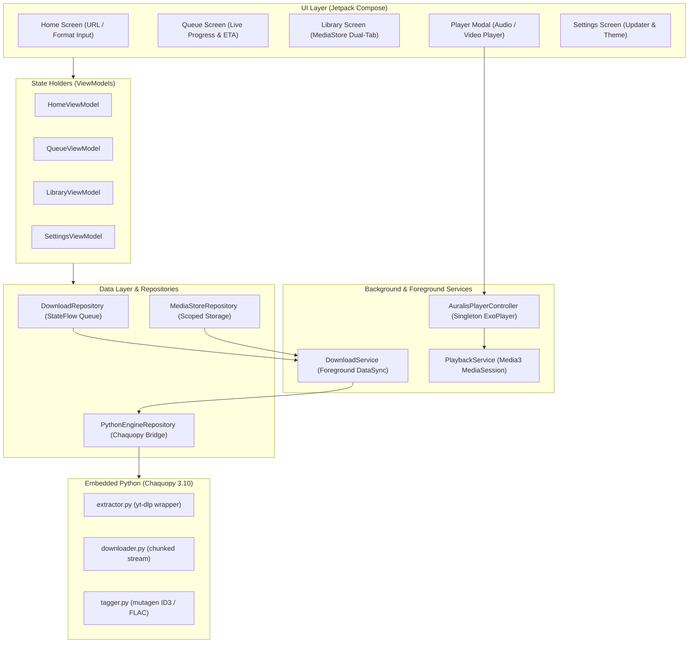
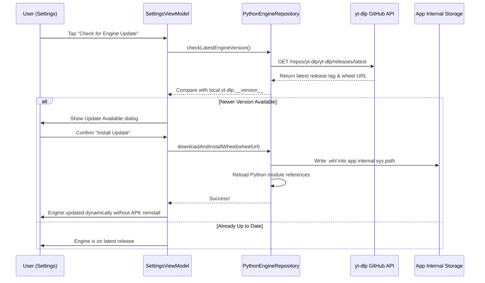

# Auralis Architecture & Technical Blueprint

This document details the architectural design, component separation, and system interactions inside **Auralis**.

---

## 🏛️ High-Level System Architecture

Auralis is structured around the **Model-View-Intent (MVI)** architectural pattern with strict unidirectional data flow and clean boundary isolation between the Android Kotlin application layer and the embedded Chaquopy Python engine.

---

## 🧩 Core Architectural Components

### 1. UI Layer (Jetpack Compose)
- **Zero Imperative Views**: Built entirely with Jetpack Compose (BOM 2024.10.01).
- **Stateless Composables**: Composable functions accept immutable state values and emit event lambdas upward.
- **Design System Tokens**: Unified color tokens, typography scales, and surface shapes defined in `ui.theme` adhere directly to the `DESIGN.md` specification.

### 2. Embedded Python Engine (Chaquopy 15.0.1)
- Chaquopy embeds a full CPython 3.10 runtime into the Android application process via native shared libraries (`libpython3.10.so`).
- **`PythonEngineRepository`** handles:
  - Initializing `Python.start(AndroidPlatform(context))` upon application launch.
  - Converting Python dictionary responses (`PyObject`) into strongly typed Kotlin data classes (`StreamInfo`, `MediaMetadata`).
  - Piping real-time download percentage and byte counts from Python hooks into Kotlin Coroutine `SharedFlow` streams.

### 3. Foreground Download Service (`DownloadService`)
- Android 14+ enforces strict foreground service types. Auralis utilizes `FOREGROUND_SERVICE_TYPE_DATA_SYNC`.
- A persistent notification keeps the download process prioritized by the Android low-memory killer (LMK) during large 4K video or multi-track downloads.
- Emits real-time notification updates with progress bars and cancel intent actions.

### 4. Media Playback Subsystem (`AndroidX Media3`)
- **`PlaybackService`**: Extends `MediaSessionService` to manage system media session bindings.
- **`AuralisPlayerController`**: A centralized singleton wrapping an `ExoPlayer` instance. It handles:
  - Audio focus management (transient loss, ducking during phone calls or navigation cues).
  - Background audio playback without UI lifecycle locks.
  - SurfaceView binding for hardware-accelerated offline video rendering.
- Lockscreen and notification controls adhere to standard Media3 protocol, allowing seamless playback control from smart watches, Bluetooth headphones, and Android Auto.

### 5. Scoped Storage & MediaStore Repository
- Rather than demanding legacy file permissions, Auralis writes directly to Android's standardized public media collections:
  - Audio: `MediaStore.Audio.Media.EXTERNAL_CONTENT_URI` (`Music/Auralis/`)
  - Video: `MediaStore.Video.Media.EXTERNAL_CONTENT_URI` (`Movies/Auralis/`)
- Downloaded files are immediately accessible across third-party gallery and media player apps without triggering slow full-disk re-indexing.

---

## ⚡ Dynamic Engine Updater Architecture

